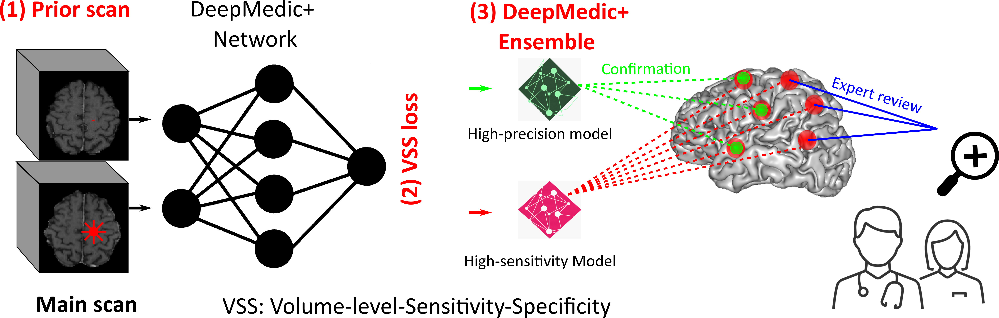

documentation/README.md

# DeepMedicBMet
## Deep learning for brain metastasis detection and segmentation in longitudinal MRI data
This is the official code repository for our Medical Physics paper "Deep learning for brain metastasis detection and segmentation in longitudinal MRI data": https://doi.org/10.1002/mp.15863

## This is the original DeepMedic with our proposed VSS loss for brain metastasis identification without prior volumes (the version with the additional prior path is in [DeepMedicPlus](https://github.com/YixingHuang/DeepMedicPlus)).
 
 The backbone of our implementation is from the [original DeepMedic repository](https://github.com/deepmedic/deepmedic). Therefore, almost all the instructions from the original DeepMedic repository still apply to our implementation.
 
 ## Graphical abstract for DeepMedicPlus (with prior path)



 ## Citation
 To use these codes, please cite [our paper](https://aapm.onlinelibrary.wiley.com/doi/10.1002/mp.15863):
 
 [1] Y. Huang, C. Bert, P. Sommer, B. Frey, U. Gaipl, L. V. Distel, T. Weissmann, M. Uder, M. A. Schmidt, A. Dörfler, A. Maier, R. Fietkau, and F. Putz, “Deep learning for brain metastasis detection and segmentation in longitudinal mri data,” Medical Physics, vol. 49, no. 9, pp. 5773–5786, 2022.
 
 Latex Bibtex:  
 ```
 @article{huang2022deep,  
 author = {Huang, Yixing and Bert, Christoph and Sommer, Philipp and Frey, Benjamin and Gaipl, Udo and Distel, Luitpold V. and Weissmann, Thomas and Uder, Michael and Schmidt, Manuel A. and Dörfler, Arnd and Maier, Andreas and Fietkau, Rainer and Putz, Florian},  
 title = {Deep learning for brain metastasis detection and segmentation in longitudinal MRI data},  
journal = {Medical Physics},  
volume = {49},  
number = {9},  
pages = {5773-5786},  
keywords = {brain metastasis, deep learning, ensemble, loss function, MRI, sensitivity specificity},  
doi = {https://doi.org/10.1002/mp.15863},  
url = {https://aapm.onlinelibrary.wiley.com/doi/abs/10.1002/mp.15863},  
eprint = {https://aapm.onlinelibrary.wiley.com/doi/pdf/10.1002/mp.15863},  
year = {2022}  
}  
```

## Contents
This repository contains our DeepMedic implementation for brain metastasis auto segmentation with our proposed volume-level sensitivity-specificity (VSS) loss.
For retraining on your own datasets, our preprocessing pipeline is also shared.

#### VSS loss
The VSS loss is located at [here](https://github.com/YixingHuang/DeepMedicBMet/blob/main/deepmedic/neuralnet/cost_functions.py).

#### Pretrained model
A pretrained model is located at 
[./DeepMedicBMet/tree/main/examples/output/saved_models/singlePathTrainingModel](https://github.com/YixingHuang/DeepMedicBMet/tree/main/examples/output/saved_models/singlePathTrainingModel/)

This model is achieved with the alpha value set to 0.95 in our VSS loss function, which has a trade-off between sensitivity and prevision from our point of view. It achieves a sensitivity of 0.914, precision of 0.830. On average, there are about 0.5 false positive metastases for each patient.

#### Data structure for inference/test
Put the main test volume paths in [DeepMedicBMet/examples/configFiles/deepMedicBM/test/testChannels_t1c.cfg](https://github.com/YixingHuang/DeepMedicBMet/blob/main/examples/configFiles/deepMedicBM/test/testChannels_t1c.cfg) 

put the corresponding label paths, ROI mask paths, and patient names in testGtLabels.cfg, testRoiMasks.cfg, and testNamesOfPredictions.cfg respectively in that folder.

#### Data preprocessing pipeline  
In order to directly apply our pretrained models, your test data should have the same [preprocessing pipeline](./Brain_MRI_Preprocessing_pipeline/) as ours.
Hopefully your MRI sequence is also T1 MPRAGE or other similar T1 sequences.
Otherwise, the performance of using our pretrained models will be suboptimal, due to different image styles.

#### Command line for inference/test with pretrained models
```python
python deepMedicRun -model ./examples/configFiles/deepMedicBM/model/modelConfig_wide1_deeper.cfg -test ./examples/configFiles/deepMedicBM/test/testConfig.cfg -load  ./examples/output/saved_models/singlePathTrainingModel/deepMedicWide1.singlePathTrainingModel.final.model.ckpt -dev cuda0
```

For Windows users, you can also use [runCMDs.py](https://github.com/YixingHuang/DeepMedicBMet/blob/main/runCMDs.py) to run multiple commands.

### Training new models for your own data
1. Preprocess the data with either your own preprocessing pipeline or [ours](./Brain_MRI_Preprocessing_pipeline/).
2. Put your training data paths in the config files of [./DeepMedicBMet/tree/main/examples/configFiles/deepMedicBM/train](https://github.com/YixingHuang/DeepMedicBMet/tree/main/examples/configFiles/deepMedicBM/train). Put the volumes, labels, and  brain masks into trainChannels_t1cAll.cfg,  trainGtLabelsAll.cfg, and trainRoiMasksAll.cfg, respectively.
3. In [trainConfigwideAll.cfg](https://github.com/YixingHuang/DeepMedicBMet/blob/main/examples/configFiles/deepMedicBM/train/trainConfigwideAll.cfg), Line 62: please add a new numberOfEpochs value.
4. Run the command for training
```python
python deepMedicRun -model ./examples/configFiles/deepMedicBM/model/modelConfig_wide1_deeper.cfg  -train ./examples/configFiles/deepMedicBM/train/trainConfigwideAll.cfg  -dev cuda0
```
5. For fast training, you can fine tune our pretrained model with your own training data with the following command:
```python
python deepMedicRun -model ./examples/configFiles/deepMedicBM/model/modelConfig_wide1_deeper.cfg  -train ./examples/configFiles/deepMedicBM/train/trainConfigwideAll.cfg  -load  ./examples/output/saved_models/singlePathTrainingModel/deepMedicWide1.singlePathTrainingModel.final.model.ckpt -dev cuda0
```

   In [trainConfigwideAll.cfg](https://github.com/YixingHuang/DeepMedicBMet/blob/main/examples/configFiles/deepMedicBM/train/trainConfigwideAll.cfg), Line 62: please add a new numberOfEpochs value,  for example, 90, then additional 30 epochs will be trained.
   
## Our System Environment
numpy version:1.19.5    it seems that there is compatibility problems with the latest numpy versions.

We run our codes in a Windows system with Python 3.7, CUDA 11.0; Higher versions should be okay.

## Acknowledgments
Our implementation is mainly based on [DeepMedic](https://github.com/deepmedic/deepmedic).
